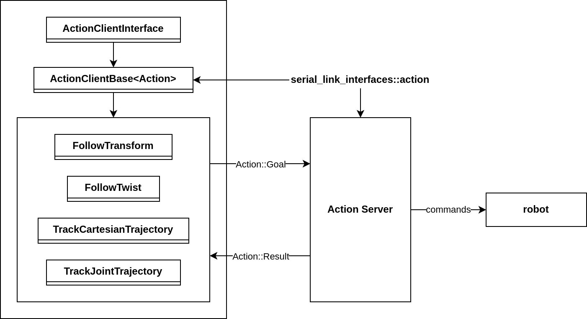
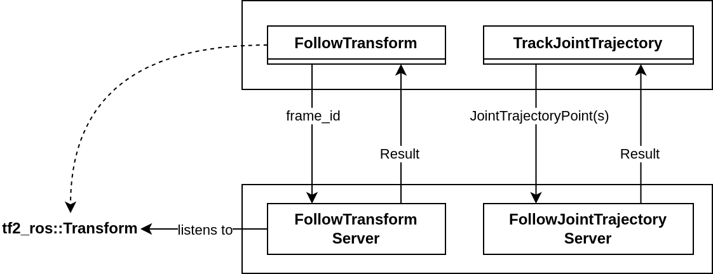
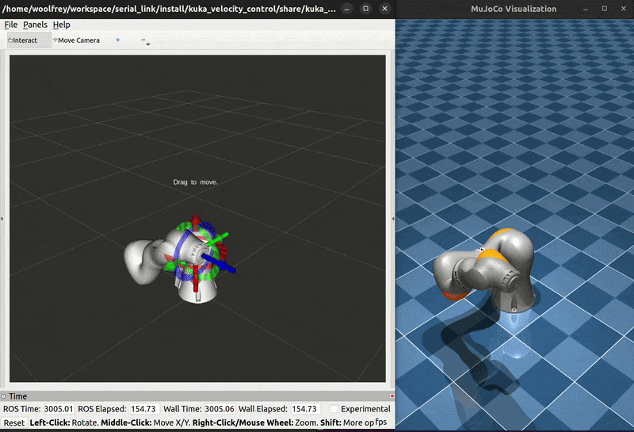
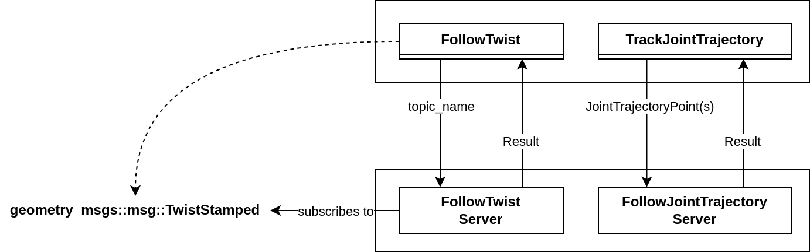
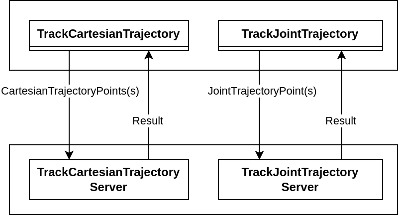

# :incoming_envelope: Serial Link Action Client

This package contains [ROS2 action clients](https://design.ros2.org/articles/actions.html) designed to interact with the [serial_link_action_server](http://github.com/Woolfrey/server_serial_link) package. The action and message definitions are defined in the [serial_link_interfaces](https://github.com/Woolfrey/interface_serial_link) package. It is primarily an example of how to write a client and use the action server(s) to control a robot. You may use them as is, modify them to suit your needs, or write your own from scratch.

#### :sparkles: Features:
- Seemless interaction with the [serial link action client](https://github.com/Woolfrey/client_serial_link) package,
- Joint space & Cartesian control,
- Helper functions to loading pre-defined joint configurations, and endpoint poses for specific robots & tasks.
- Templated `ActionClientInterface` & `ActionClientBase` classes for quick implementation of your own custom action clients.

> [!TIP]
> Check out [this repository](https://github.com/Woolfrey/control_kuka_velocity) for an example of how to run the action servers & action clients to control a robot.

#### :compass: Navigation
- [Requirements](#clipboard-requirements)
- [Installation](#floppy_disk-installation)
- [Classes](#card_file_box-classes)
- [Nodes](#satellite-nodes)
- [Release Notes](#package-release-notes---v100-april-2025)
- [Contributing](#handshake-contributing)
- [License](#scroll-license)

## :clipboard: Requirements

- [Ubuntu 22.04](https://ubuntu.com/blog/tag/22-04-lts), or later,
- [ROS2 Humble](https://docs.ros.org/en/humble/index.html), or later, the
- The [serial link interfaces](https://github.com/Woolfrey/interface_serial_link) package,
- The [serial_link_action_server](https://github/com/Woolfrey/server_serial_link) package (unless using your own).

> [!NOTE]
> This package was built and tested using Ubuntu 22.04, and ROS2 Humble.

## :floppy_disk: Installation

Your directory structure should end up looking something like this:
```
ros2_workspace/
├── build/
├── install/
├── log/
└── src/
    ├── client_serial_link/
    |   ├── doc/
    |   ├── include/
    |   ├── src/
    |   ├── CMakeLists.txt
    |   ├── LICENSE
    |   ├── package.xml
    |   └── README.md
    ├── interface_serial_link/
    └── server_serial_link/ (optional)
```

1. In the `src/` directory of your ROS2 workspace, clone the interfaces repository:

```
git clone https://github.com/Woolfrey/interface_serial_link.git
```

2. Clone the action client repository:

```
git clone http://github.com/Woolfrey/client_serial_link.git
```

3. Navigate back to the root of your ROS2 workspace and build:

```
colcon build
```

4. Source the local directory (if you haven't yet altered your .bashrc file):

```
source ./install/setup.bash
```

5. Check successful installation:

```
ros2 pkg list
```
   
If you scroll down the list, you should see both `serial_link_action_client`, and `serial_link_interfaces`.

[:top: Back to Top.](#incoming_envelope-serial-link-action-client)

## :card_file_box: Classes

This package contains several classes that implement the action clients for actions defined in [interface repository](https://github.com/Woolfrey/interface_serial_link). 

<p align="center">
    
</p>

- The `ActionClientInterface` provides polymorphism for interacting with actions of different types.
- The `ActionClientBase` is a templated class providing a standardised stucture to all action clients.
- The other classes, e.g. `FollowTwist`, `TrackCartesianTrajectory`, etc. implement the constructors and `result_callback` methods specific to the actions.

[:top: Back to Top.](#incoming_envelope-serial-link-action-client)

## :satellite: Nodes

This package contains nodes with pre-configured clients that you can use. You may apply them as is, modify them to suit your task, or write your own from scratch. They are executed via `ros2 run`, rather than `ros2 launch`, as the latter doesn't allow you to enter command prompts in the terminal for some reason :shrug:

For example, in my [Kuka velocity control](https://github.com/Woolfrey/control_kuka_velocity), I would run:
```
ros2 run serial_link_action_client follow_transform_client --ros-args --params-file "config/iiwa_joint_configurations.yaml" --params-file "config/tolerances.yaml"
```

The client executables use helper functions specified in the `utilities.h` header file to load pre-defined joint configurations:
```
/**:
  ros__parameters:
    number_of_joints: 7                            # We need this to split up the position arrays
    joint_config_names: ["home", "ready", "multi"] # We need to declare them here so we can search them by name
    home:
        positions: [0.0, 0.0, 0.0, 0.0, 0.0, 0.0, 0.0]
        times: [5.0]
    ready:
        positions: [1.844, -0.656, -1.782, -1.383, 0.060, 0.0311, -0.705]
        times: [5.0]
    multi:
        positions: [2.570, -0.484, -1.865, -1.495, 1.063, -0.699,  -1.500,
                    1.844, -0.656, -1.782, -1.383, 0.060,  0.0311, -0.705,
                    0.000,  0.000,  0.000,  0.000, 0.000,  0.0000,  0.000]
        times: [4.0, 8.0, 12.0]
```
and pre-defined Cartesian poses:
```
/**:
  ros__parameters:
    pose_names: ["up", "down", "left", "right"] # We need to declare them here so we can search them by name
    up:
        poses: [0.0, 0.0, 0.2, 0.0, 0.0, 0.0]
        times: [3.0]
        reference: "relative"
    down:
        poses: [0.0, 0.0, -0.2, 0.0, 0.0, 0.0]
        times: [3.0]
        reference: "relative"
    left:
        poses: [0.0, 0.2, 0.0, 0.0, 0.0, 0.0]
        times: [3.0]
        reference: "relative"
    right:
        poses: [0.0, -0.2, 0.0, 0.0, 0.0, 0.0]
        times: [3.0]
        reference: "relative"
```
These are inserted in to a `std::map<std::string, std::vector<serial_link_interfaces::JointTrajectoryPoint>>`, and `std::map<std::string, std::vector<serial_link_interfaces::CartesianTrajectoryPoint>>` so that you can easily search for and add them to the action goal field.

The `tolerances.yaml` file contains parameters that are used as part of the various goal fields in the different actions:
```
/**:
  ros__parameters:
    tolerance:
        timeout: 0.1                               # s                      
        joint: [0.5, 0.5, 0.5, 0.5, 0.5, 0.5, 0.5] # rad
        pose:
            position: 0.2                          # m
            orientation: 0.35                      # rad
        twist:
            linear: 0.5                            # m/s
            angular: 1.0                           # rad/s
```

### Follow Transform Client

This client loads both the `TrackJointTrajectory` client and the `FollowTransform` client. The former lets you move the robot in to pre-defined joint configurations. The latter, when activated, will follow a `tf2_ros::Transform` that is somehow broadcast over the ROS2 network. The server is supposed to control the robot so that the endpoint of the robot follows this transform in real time.

To run this client use something like:
```
ros2 run serial_link_action_client follow_transform_client --ros-args --params-file "config/joint_configurations.yaml" --params-file "config/tolerances.yaml"
```

<p align="center">
    
</p>

<p align="center">
    
</p>

### Follow Twist Client

This client loads the `TrackJointTrajectory` and `FollowTwist` clients. You use the former to move the robot in to a pre-defined joint configuration. Then the latter is used to subscribe to a `geometry_msgs::msg::TwistStamped` that is somehow being published over the ROS2 network. The server is supposed to control the endpoint of the robot arm to follow this twist command in real time.

To run this client use something like:
```
ros2 run serial_link_action_client follow_twist_client --ros-args --params-file "config/joint_configurations.yaml" --params-file "config/tolerances.yaml"
```

<p align="center">
    
</p>

<p align="center">
    
</p>

### Track Trajectory Client

This client has both the `TrackJointTrajectory` and `TrackCartesianTrajectory` actions. The first is used to move the robot to different joint configurations. The second specifies `CartesianTrajectoryPoint` waypoints so the corresponding action server will generate and follow a trajectory defined by them.

To run, use something like:
```
ros2 run serial_link_action_client --ros-args --params-file "$config/endpoint_poses.yaml" --params-file "config/joint_configurations.yaml" --params-file "config/tolerances.yaml"
```
(Note the extra `endpoint_poses.yaml` argument compared to the previous two).


<p align="center">
    
</p>

<p align="center">
    
</p>

[:top: Back to Top.](#incoming_envelope-serial-link-action-client)

## :package: Release Notes - v1.0.0 (April 2025)

### :tada: First Release:

**Classes:**
- ActionClientInterface
- ActionClientBase (templated)
- FollowTransform
- FollowTwist
- TrackCartesianTrajectory
- TrackJointTrajectory

**Nodes:**
- follow_transform_client
- follow_twist_client
- track_trajectory_client
 
[:top: Back to Top.](#incoming_envelope-serial-link-action-client)

## :handshake: Contributing

Contributions are always welcome. Feel free to fork the repository, make changes, and issue a pull request.

You can also raise an issue asking for new features.

[:top: Back to Top.](#incoming_envelope-serial-link-action-client)

## :scroll: License

This software package is licensed under the [GNU General Public License v3.0 (GPL-3.0)](https://choosealicense.com/licenses/gpl-3.0/). You are free to use, modify, and distribute this package, provided that any modified versions also comply with the GPL-3.0 license. All modified versions must make the source code available and be licensed under GPL-3.0. The license also ensures that the software remains free and prohibits the use of proprietary restrictions such as Digital Rights Management (DRM) and patent claims. For more details, please refer to the [full license text](LICENSE).

[:top: Back to Top.](#incoming_envelope-serial-link-action-client)

